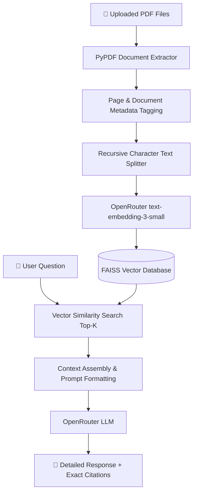

# 📄 ChatPDF Intelligence — Chat with PDFs using OpenRouter & FAISS

[](https://www.python.org/)
[](https://streamlit.io/)
[](https://python.langchain.com/)
[](https://openrouter.ai/)
[](LICENSE)

An intelligent, multi-document conversational AI application powered by **OpenRouter** multi-model LLMs, **LangChain LCEL**, and **FAISS Vector Database**. Upload single or multiple PDF documents, automatically index and extract knowledge, and ask questions with precise page citations and context highlights.

---

## 🌟 Key Features

- **Multi-Document PDF Ingestion**: Upload multiple PDFs simultaneously; extracts text page-by-page while preserving exact document and page metadata.
- **Accurate Document Citations**: Every answer provides an expandable source breakdown citing the exact document name, page number, and matched chunk text.
- **OpenRouter Multi-Model Power**: Query documents using any frontier or open-source model including DeepSeek, LLaMA, Qwen, or OpenAI models.
- **High-Performance Vector Search**: Uses OpenRouter's `text-embedding-3-small` (1536-dim embeddings) paired with in-memory **FAISS** similarity indexing.
- **Modern LCEL Architecture**: Modern LangChain Expression Language (`prompt | llm | StrOutputParser()`) — clean, future-proof, with zero deprecation warnings.
- **Interactive Chat Interface**: Multi-turn conversational flow with custom glassmorphism styling, metrics dashboard, quick prompt shortcuts, and chat clearing.
- **Secure Key Management**: API keys are loaded securely from `.env` and kept hidden from the UI and HTML DOM.

---

## 🏛 Architecture Overview



---

## 🚀 Quick Start Guide

### 1. Clone the Repository

```bash
git clone https://github.com/ruturajg4/ChatPDF.git
cd ChatPDF
```

### 2. Create and Activate a Virtual Environment

**Windows:**
```powershell
python -m venv .venv
.\.venv\Scripts\activate
```

**macOS / Linux:**
```bash
python3 -m venv .venv
source .venv/bin/activate
```

### 3. Install Dependencies

```bash
pip install -r requirements.txt
```

### 4. Configure Your OpenRouter API Key

1. Obtain an API key from [OpenRouter](https://openrouter.ai/keys).
2. Copy the template configuration file:
   ```bash
   cp .env.example .env
   ```
3. Open `.env` and add your key:
   ```env
   OPENROUTER_API_KEY="your_openrouter_api_key_here"
   ```
*(Alternatively, you can input your API key directly into the sidebar in the web application).*

### 5. Launch the Application

```bash
streamlit run app.py
```

The application will launch in your browser at `http://localhost:8501`.

---

## ⚙️ Configuration & Parameters

| Parameter | Default | Options | Description |
|---|---|---|---|
| **Language Model** | `stealth/space-bunny-alpha` | `meta-llama/llama-3.3-70b-instruct`, `deepseek/deepseek-r1`, `openai/gpt-4o-mini`, etc. | LLM used for comprehension and answer synthesis |
| **Embedding Model** | `text-embedding-3-small` | `text-embedding-3-small`, `text-embedding-3-large` | Semantic embeddings powered by OpenRouter |
| **Temperature** | `0.2` | `0.0` - `1.0` | Lower values ensure factual, grounded document answers |
| **Chunk Size** | `1000` | `300` - `3000` | Character length for each split chunk |
| **Chunk Overlap** | `200` | `50` - `500` | Overlapping characters between consecutive chunks |
| **Retrieved Chunks ($k$)** | `4` | `2` - `8` | Number of most relevant passages sent to the LLM |

---

## 📁 Repository Structure

```
ChatPDF/
├── .github/workflows/  # Automated GitHub Actions CI pipeline
├── .streamlit/         # Production Streamlit cloud configurations
├── Dockerfile          # Production container deployment definition
├── app.py              # Main Streamlit web application & LCEL RAG pipeline
├── requirements.txt    # Pinned, tested Python dependencies
├── .env.example        # Environment variable template for API keys
├── .gitignore          # Safeguards API keys, caches, and virtual environments
├── LICENSE             # MIT Open Source License
└── README.md           # Comprehensive project documentation
```

---

## 🔒 Security Best Practices

- **Never Commit Secrets**: The `.gitignore` file is pre-configured to ignore `.env`, `.venv`, and cached FAISS indices.
- **Hidden in DOM**: The Streamlit interface hides your active API key and never transmits secrets to HTML value tags.
- **Local FAISS Storage**: Vector indices are computed and kept in memory for your session.

---

## 📝 License

Distributed under the MIT License. See [LICENSE](LICENSE) for more information.

---

**Developed with ❤️ by [ruturajg4](https://github.com/ruturajg4)**
